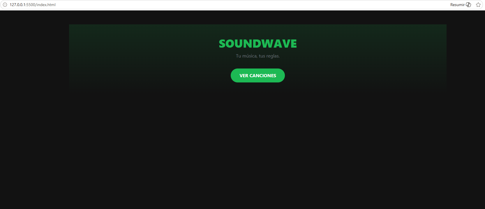
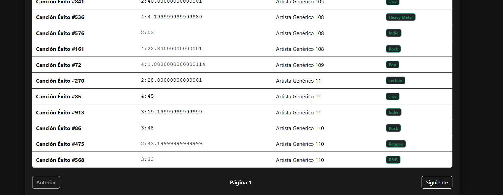
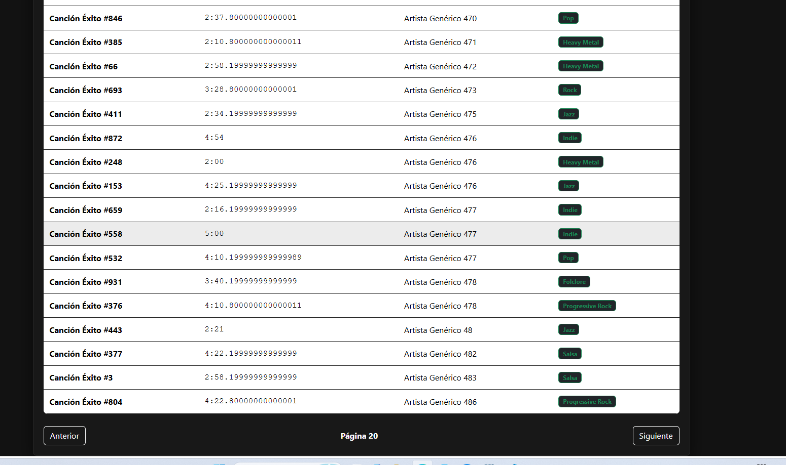
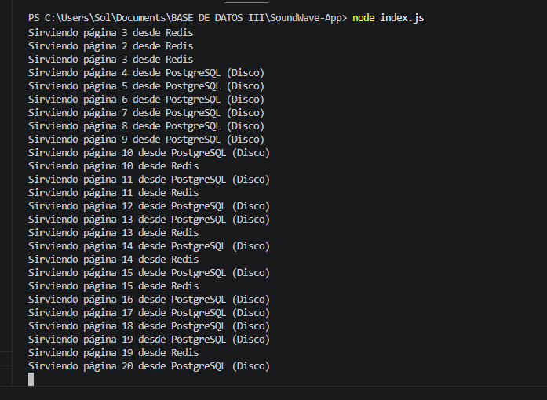

# SoundWave - Redis Cache ??

Optimización de rendimiento mediante **Paginación** y estrategia de caché **Cache-Aside**.

## ?? Cómo Ejecutar

1. **Levantar Redis (Docker):**
   \\\ash
   docker run -d --name redis-soundwave -p 6379:6379 redis
   \\\
2. **Instalar dependencias e iniciar:**
   \\\ash
   npm install
   node index.js
   \\\
3. **Frontend:** Abrir \index.html\ con *Live Server*.

---

## ?? Funcionamiento (Cache-Aside)

* **Paginación:** Trae el catálogo en bloques de a 20 canciones para evitar la saturación del navegador.
* **HIT:** Si la página ya se consultó, se sirve instantáneamente desde la RAM (Redis).
* **MISS:** Si es la primera vez, se busca en PostgreSQL y se guarda en Redis con un **TTL de 60 segundos**.

---

## ?? Evidencias de Funcionamiento

### ??? Interfaz de Usuario (Frontend)
* **Pantalla de Inicio:** 
* **Catálogo Paginado:** 
* **Navegación entre Páginas:** 

### ?? Logs del Servidor (Backend)
Al consultar una página por primera vez se lee desde el disco (PostgreSQL). Al regresar a ella, la caché se activa y responde directamente desde la memoria RAM:  

